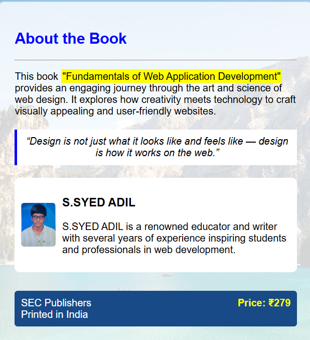

# Ex.05 Book Cover Page Design
## Date:12.03.2026

## AIM:
To design a book back cover page using HTML and CSS.

## DESIGN STEPS:

### Step 1:
Create a Django Admin project.

### Step 2:
Create an app in the Django interface.

### Step 3:
Create a folder named 'static' in the app folder.

### Step 4:
Create a new HTML file in the static folder.

### Step 5:
Write the HTML code with relevant CSS properties.

### Step 6:
Choose the appropriate style and color scheme.

### Step 7:
Insert the images in their appropriate places.

### Step 8:
Publish the website in the LocalHost.

## PROGRAM:
~~~

HTML

<!DOCTYPE html>
<html>
<head>
<title>Book Cover</title>
<link rel="stylesheet" href="style.css">
</head>

<body>

<h2>About the Book</h2>

This book "Fundamentals of Web Application Development"
provides an engaging journey through the art and science of web design.
It explores how creativity meets technology to craft visually appealing
and user-friendly websites.

“Design is not just what it looks like and feels like — design is how it works on the web.”

<h3>S.SYED ADIL</h3>

S.SYED ADIL is a renowned educator and writer with several years of experience inspiring students and professionals in web development.

SEC Publishers Printed in India
Price: ₹279

</body>
</html>
~~~
CSS
~~~

body{
font-family: Arial;
background: url("https://images.unsplash.com/photo-1501785888041-af3ef285b470");
background-size: cover;
display:flex;
justify-content:center;
align-items:center;
height:100vh;
}

.book{
width:450px;
padding:25px;
background:rgba(255,255,255,0.8);
border-radius:10px;
border:2px solid lightblue;
}

h2{
color:blue;
}

.highlight{
background:yellow;
padding:2px;
}

.quote{
background:white;
padding:10px;
margin:20px 0;
border-left:4px solid blue;
font-style:italic;
text-align:center;
}

.author{
display:flex;
align-items:center;
background:white;
padding:10px;
border-radius:8px;
}

.author img{
width:70px;
height:70px;
margin-right:10px;
border-radius:5px;
}

.footer{
margin-top:30px;
background:#174a87;
color:white;
padding:10px;
display:flex;
justify-content:space-between;
border-radius:5px;
}

.price{
color:yellow;
font-weight:bold;
}
~~~

## OUTPUT:

## RESULT:
The program for designing book back cover page using HTML and CSS is completed successfully.
